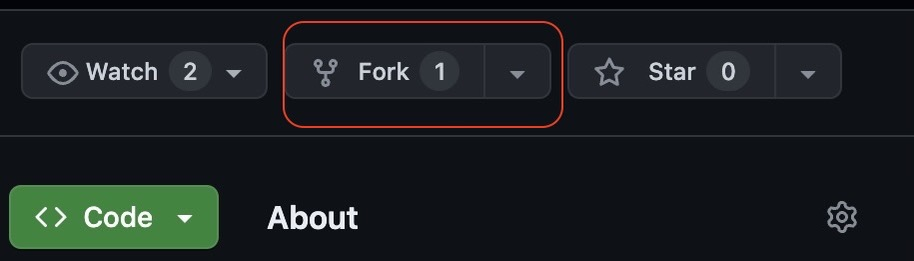
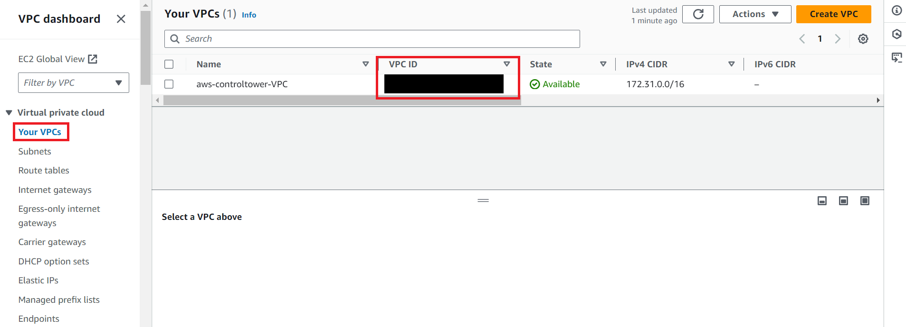
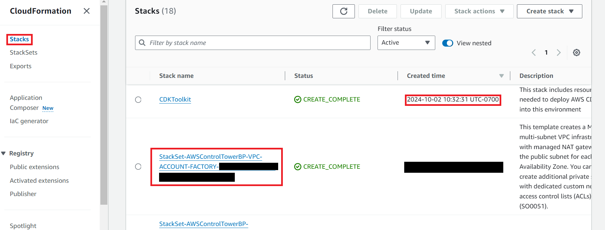

# Deployment Guide

## Table of Contents

- [Deployment Guide](#deployment-guide)
  - [Table of Contents](#table-of-contents)
  - [Requirements](#requirements)
  - [Deployment](#deployment)
    - [Step 1: Fork \& Clone The Repository](#step-1-fork--clone-the-repository)
    - [Step 2: Upload Secrets](#step-2-upload-secrets)
      - [CDK Deployment in Hybrid Cloud Environment](#cdk-deployment-in-hybrid-cloud-environment)
      - [Step-by-Step Instructions](#step-by-step-instructions)
    - [Step 3: CDK Deployment](#step-3-cdk-deployment)
  - [Post-Deployment](#post-deployment)
    - [Step 1: Connect to GitHub](#step-1-connect-to-github)
    - [Step 2: Build AWS Amplify App](#step-2-build-aws-amplify-app)
    - [Step 3: Visit Web App](#step-3-visit-web-app)
  - [Cleanup](#cleanup)
    - [Taking down the deployed stack](#taking-down-the-deployed-stack)

## Requirements

Before you deploy, you must have the following installed on your device:

- [git](https://git-scm.com/downloads)
- [AWS Account](https://aws.amazon.com/account/)
- [GitHub Account](https://github.com/)
- [AWS CLI](https://aws.amazon.com/cli/)
- [AWS CDK](https://docs.aws.amazon.com/cdk/v2/guide/cli.html) _(v2.122.0 > required)_
- [npm](https://docs.npmjs.com/downloading-and-installing-node-js-and-npm)
- [node](https://nodejs.org/en/ln/getting-started/how-to-install-nodejs) _(v20.0.0 > required)_
- [node](https://nodejs.org/en/ln/getting-started/how-to-install-nodejs) _(v20.0.0 > required)_

## Deployment

### Step 1: Fork & Clone The Repository

First, you need to fork the repository. To create a fork, navigate to the [main branch](https://github.com/UBC-CIC/AI-Learning-Assistant) of this repository. Then, in the top-right corner, click `Fork`.



You will be directed to the page where you can customize owner, repository name, etc, but you do not have to change any option. Simply click `Create fork` in the bottom right corner.

Now let's clone the GitHub repository onto your machine. To do this:

1. Create a folder on your computer to contain the project code.
2. For an Apple computer, open Terminal. If on a Windows machine, open Command Prompt or Windows Terminal. Enter into the folder you made using the command `cd path/to/folder`. To find the path to a folder on a Mac, right click on the folder and press `Get Info`, then select the whole text found under `Where:` and copy with ⌘C. On Windows (not WSL), enter into the folder on File Explorer and click on the path box (located to the left of the search bar), then copy the whole text that shows up.
3. Clone the GitHub repository by entering the following command. Be sure to replace `<YOUR-GITHUB-USERNAME>` with your own username.

```
git clone https://github.com/<YOUR-GITHUB-USERNAME>/AI-Learning-Assistant.git
```

The code should now be in the folder you created. Navigate into the root folder containing the entire codebase by running the command:

```
cd AI-Learning-Assistant
```

### Step 2: Upload Secrets

You will need to upload your github username to Amazon SSM Parameter Store. You can do so by running the following command. Make sure you replace `<YOUR-GITHUB-USERNAME>` and `<YOUR-PROFILE-NAME>` with your actual username and the appropriate AWS profile name.

&nbsp;

Moreover, you will need to upload your github username to Amazon SSM Parameter Store. You can do so by running the following command. Make sure you replace `<YOUR-GITHUB-USERNAME>` and `<YOUR-PROFILE-NAME>` with your actual username and the appropriate AWS profile name.

<details>
<summary>macOS</summary>

```bash
aws ssm put-parameter \
    --name "aila-owner-name" \
    --value "<YOUR-GITHUB-USERNAME>" \
    --type String \
    --profile <YOUR-PROFILE-NAME>
```

</details>

<details>
<summary>Windows CMD</summary>

```cmd
aws ssm put-parameter ^
    --name "aila-owner-name" ^
    --value "<YOUR-GITHUB-USERNAME>" ^
    --type String ^
    --profile <YOUR-PROFILE-NAME>
```

</details>

<details>
<summary>PowerShell</summary>

```powershell
aws ssm put-parameter `
    --name "aila-owner-name" `
    --value "<YOUR-GITHUB-USERNAME>" `
    --type String `
    --profile <YOUR-PROFILE-NAME>
```

</details>

&nbsp;

You would have to supply a custom database username when deploying the solution to increase security. Run the following command and ensure you replace `<YOUR-DB-USERNAME>` with the custom name of your choice.

<details>
<summary>macOS</summary>

```bash
aws secretsmanager create-secret \
    --name AILASecrets \
    --secret-string "{\"DB_Username\":\"<YOUR-DB-USERNAME>\"}"\
    --profile <your-profile-name>
```

</details>

<details>
<summary>Windows CMD</summary>

```cmd
aws secretsmanager create-secret ^
    --name AILASecrets ^
    --secret-string "{\"DB_Username\":\"<YOUR-DB-USERNAME>\"}"^
    --profile <your-profile-name>
```

</details>

<details>
<summary>PowerShell</summary>

```powershell
aws secretsmanager create-secret `
    --name AILASecrets `
    --secret-string "{\"DB_Username\":\"<YOUR-DB-USERNAME>\"}"`
    --profile <your-profile-name>
```

</details>

&nbsp;

For example,

```
aws secretsmanager create-secret \
    --name AILASecrets \
    --secret-string '{\"DB_Username\":\"AILASecrets\"}'\
    --profile <your-profile-name>
```

Finally, in order to restrict user sign up to specific email domains, you will need to upload a comma separated list of allowed email domains to Amazon SSM Parameter Store. You can do so by running the following command. Make sure you replace `<YOUR-ALLOWED-EMAIL-DOMAIN-LIST>` and `<YOUR-PROFILE-NAME>` with your actual list and the appropriate AWS profile name.

<details>
<summary>macOS</summary>

```bash
aws ssm put-parameter \
    --name "/AILA/AllowedEmailDomains" \
    --value "<YOUR-ALLOWED-EMAIL-DOMAIN-LIST>" \
    --type SecureString \
    --profile <YOUR-PROFILE-NAME>
```

</details>

<details>
<summary>Windows CMD</summary>

```cmd
aws ssm put-parameter ^
    --name "/AILA/AllowedEmailDomains" ^
    --value "<YOUR-ALLOWED-EMAIL-DOMAIN-LIST>" ^
    --type SecureString ^
    --profile <YOUR-PROFILE-NAME>
```

</details>

<details>
<summary>PowerShell</summary>

```powershell
aws ssm put-parameter `
    --name "/AILA/AllowedEmailDomains" `
    --value "<YOUR-ALLOWED-EMAIL-DOMAIN-LIST>" `
    --type SecureString `
    --profile <YOUR-PROFILE-NAME>
```

</details>

&nbsp;

For example,

```
aws ssm put-parameter \
    --name "/AILA/AllowedEmailDomains" \
    --value "gmail.com,ubc.ca" \
    --type SecureString \
    --profile <YOUR-PROFILE-NAME>
```

#### Step 3a: CDK Deployment with an Existing VPC

The following set of instructions are only if you want to deploy this application with an **existing VPC**. If you do not want to do this you can skip this section.

In order to deploy, you will need to have access to the **aws-controltower-VPC** and the name of your **AWSControlTowerStackSet**.

#### Step-by-Step Instructions

1. **Modify the VPC Stack:**
   - Navigate to the `vpc-stack.ts` file located at `cdk/lib/vpc-stack.ts`.
   - Replace **line 16** with your existing VPC ID:

     ```typescript
     const existingVpcId: string = "your-vpc-id"; //CHANGE IF DEPLOYING WITH EXISTING VPC
     ```

     You can find your VPC ID by navigating to the **VPC dashboard** in the AWS Management Console and locating the VPC in the `Your VPCs` section.

     

2. **Update the AWS Control Tower Stack Set:**
   - Replace **line 19** with your AWS Control Tower Stack Set name:

     ```typescript
     const AWSControlTowerStackSet = "your-stackset-name"; //CHANGE TO YOUR CONTROL TOWER STACK SET
     ```

     You can find this name by navigating to the **CloudFormation dashboard** in AWS, under `Stacks`. Look for a stack name that starts with `StackSet-AWSControlTowerBP-VPC-ACCOUNT-FACTORY`.

     

#### Second deployment in the Environment with an Existing VPC:

The following set of instructions are only if this is the second project you are deploying with an **Existing VPC**. If you do not want to do this you can skip this section.

In order to deploy a second project with a pre-existing vpc, you will need to have access to the **Public Subnet ID**.

####

### **3. Update the Public Subnet ID and CIDR Range**

To deploy a second project with a pre-existing vpc, you need to obtain an available **Public Subnet ID** and an unused **CIDR range** within the VPC.

#### **Finding the Public Subnet ID**

1. **Navigate to the AWS VPC Console**:
   - Log in to the AWS Management Console.
   - Search for and open the **VPC** service.

2. **Locate the Existing Public Subnet**:
   - In the left-hand menu, click **Subnets**.
   - Identify the **public subnet** used by your first deployment. You can confirm it is a public subnet by checking if it has a **Route Table** entry pointing to an **Internet Gateway**.

3. **Copy the Subnet ID**:
   - Once you've identified the correct public subnet, note down its **Subnet ID** for later use.
   - You will replace the placeholder in your `vpc-stack.ts` file as follows:
     ```typescript
     const existingPublicSubnetID: string = "your-public-subnet-id"; // CHANGE IF DEPLOYING WITH EXISTING PUBLIC SUBNET
     ```

#### **Finding an Available CIDR Range**

AWS subnets within a VPC cannot overlap in CIDR range, so you need to select an unused range that aligns with existing allocations.

1. **Check Existing CIDR Allocations**:
   - In the **VPC Console**, navigate to **Your VPCs** and find the VPC where your first project was deployed.
2. **Check Used Subnet CIDR Ranges**:
   - Go to **Subnets** and find all subnets associated with your VPC.
   - Look at the **CIDR Blocks** of each existing subnet (e.g., `172.31.0.0/20`, `172.31.32.0/20`, etc.).

3. **Determine the Next Available CIDR Block**:
   - The third number in the CIDR block (e.g., `172.31.XX.0/20`) must be a **multiple of 32** (e.g., `0, 32, 64, 96, 128, 160, 192, 224`).
   - Identify the first unused **/20** block by checking which multiples of 32 are already in use.

4. **Example**:
   - If the existing subnets are `172.31.0.0/20`, `172.31.32.0/20`, and `172.31.64.0/20`, the next available range should be `172.31.96.0/20`.

5. **Update the `vpc-stack.ts` File**:
   - Replace the placeholder with the available CIDR block:
     ```typescript
     this.vpcCidrString = "172.31.96.0/20"; // Update based on availability
     ```

By following these steps, you ensure that the new subnet does not overlap with existing ones while maintaining correct alignment with AWS best practices.

You can proceed with the rest of the deployment instructions and the Vpc Stack will automatically use your existing VPC instead of creating a new one. For more detailed information about the deployment with an Existing VPC checkout the [Existing VPC Deployment Guide](/docs/ExistingVPCDeployment.md)

### Step 3: CDK Deployment

It's time to set up everything that goes on behind the scenes! For more information on how the backend works, feel free to refer to the Architecture Deep Dive, but an understanding of the backend is not necessary for deployment.

**Note: The Docker images for Lambda functions are built and pushed to ECR via AWS CodePipeline, which is triggered by the GitHub App connection. You do not need Docker Desktop running locally for this deployment.**

Open a terminal in the `/cdk` directory.

**Download Requirements**: Install requirements with npm by running `npm install` command.

**Initialize the CDK stack**(required only if you have not deployed any resources with CDK in this region before). Please replace `<your-profile-name>` with the appropriate AWS profile used earlier.

```
cdk synth --profile <your-profile-name>
cdk bootstrap aws://<YOUR_AWS_ACCOUNT_ID>/<YOUR_ACCOUNT_REGION> --profile <your-profile-name>
```

**Deploy CDK stack**
You may run the following command to deploy the stacks all at once. Again, replace `<your-profile-name>` with the appropriate AWS profile used earlier. Also replace `<your-stack-prefix>` with the appropriate stack prefix.
The stack prefix will be prefixed onto the physical names of the resources created during deployment.

```
cdk deploy --all \
 --context githubRepo=<your-github-repo-name> \
 --context StackPrefix=<your-stack-prefix> \
 --profile <your-profile-name>
```

For example:

```
cdk deploy --all --context githubRepo=AI-Learning-Assistant --context StackPrefix=AILA-1 --profile dev_AILA
```

If you have trouble running the commands, try removing all the \ and run it in one line.

### Step 4: Authorize GitHub Connection

After the CDK deployment initiates, you will need to authorize the connection between AWS and GitHub.

1.  Log in to the AWS Console and navigate to **Developer Tools** > **Settings** > **Connections**.
2.  You will see a connection with a name like `<your-stack-prefix>-conn` in a **Pending** status.
3.  Click on the connection name.
4.  Click **Update pending connection**.
5.  Follow the prompts to authorize access to your GitHub account and the repository.
6.  Once authorized, the status will change to **Available**, and the CodePipeline will automatically trigger the build process.

## Post-Deployment

### Step 1: Connect to GitHub

1. Log in to the AWS console, and navigate to **AWS Amplify**.
2. Select the app named `aila-amplify`.
3. You will see a banner or button to **Hosting environments** or **Connect branch**.
4. Since the app is created without a source provider, you need to connect your repository.
5. Follow the steps to connect your GitHub repository (`AI-Learning-Assistant`) and select the `main` branch.
6. Grant the necessary permissions if prompted.

### Step 2: Build AWS Amplify App

1. Once connected, Amplify should automatically start a build. If not, click `Run build` for the `main` branch.
2. Wait for the build and deploy to complete.
3. You now have access to the `Amplify App ID` and the public domain name to use the web app.

### Step 3: Visit Web App

You can now navigate to the web app URL to see your application in action.

## Cleanup

### Taking down the deployed stack

To take down the deployed stack for a fresh redeployment in the future, navigate to AWS Cloudformation on the AWS Console, click on the stack and hit Delete.

Please wait for the stacks in each step to be properly deleted before deleting the stack downstream.

Also make sure to delete secrets in Secrets Manager.
