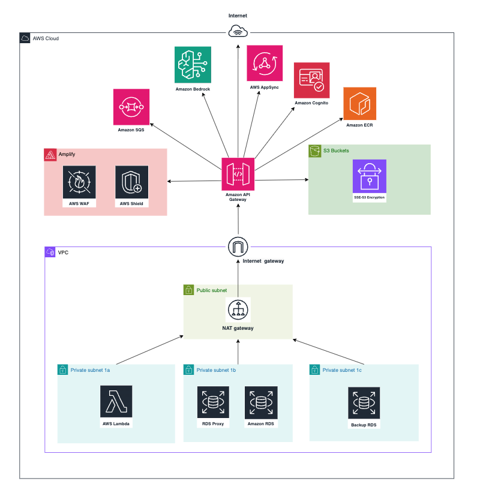
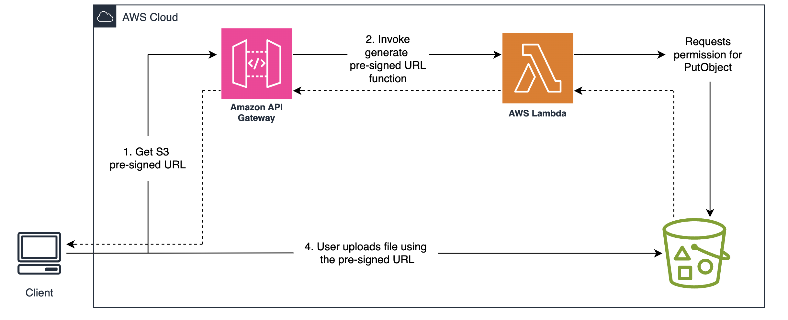

# Security Documentation & Network Architecture  

## 1. Network Architecture




### 1.1 VPC & Subnets  
VPC Configuration:  
- Leveraged existing VPC in AWS Hybrid Account (organizational policies prevent new VPC creation)  
- CIDR Range: 172.31.0.0/16 (inherited from existing VPC configuration)  

#### Subnet Configuration:  

| Subnet Type | CIDR           | AZ              | Key Services                       |
|-------------|----------------|-----------------|------------------------------------|
| Private     | 172.31.32.0/20 | ca-central-1a   | Lambda                             |
| Private     | 172.31.64.0/20 | ca-central-1b   | RDS Proxy                          |
| Private     | 172.31.80.0/20 | ca-central-1c   | Backup Services                    |
| Public      | 172.31.XX.0/20 | ca-central-1    | NAT Gateway, Internet Gateway      |


#### Services Deployment:  

#### Private Subnets:  
- **AWS Lambda:**   
  - Runtime environment for application logic  
  - No public IP addresses  
  - Outbound internet via NAT Gateway  

- **Amazon ECR:**
  - Lambda functions utilize Docker images stored in Amazon ECR 
  - Images are securely pulled over the internet via the NAT Gateway

- **Amazon RDS (PostgreSQL):**  
  - Accessed exclusively via RDS Proxy  
  - No direct public access  
  - Encrypted connections via SSL/TLS  

  Since VPC Endpoints are not used, Lambda accesses S3, ECR, and other AWS services over the public internet through the NAT Gateway.


#### Public Subnets:  
- **NAT Gateway:** 
  - Required for private subnet services to fetch external packages/updates  
  - Egress-only internet access for Lambda  
  - Cost-optimized single AZ deployment  

- **Internet Gateway:** 
  - Enables public access to API Gateway  
  - Managed by central cloud team in Hybrid Account  

#### Non-VPC Services:  
- **S3 Buckets:**
  - Accessed via NAT Gateway through Lambda functions  
  - No internet routing through NAT Gateway  

  Explanation of S3 Usage:

  

  The above diagram illustrates the use of S3 pre-signed URLs in our architecture. The process works as follows:

  1. Client Request: The client first requests a pre-signed URL by making an API call to the Amazon API Gateway

  2. Pre-Signed URL Generation: The API Gateway invokes an AWS Lambda function, which is responsible for generating the pre-signed URL. The Lambda function checks for the appropriate permissions (PutObject action) for the requested S3 bucket

  3. Permission Validation: If permissions are validated, the Lambda function returns the generated pre-signed URL to the client

  4. File Upload: The client uses this pre-signed URL to upload files directly to S3, bypassing the need for the server to handle large file uploads. This approach ensures:

      - Secure, time-limited access to the S3 bucket without exposing long-term credentials

      - Offloading file transfer workload from backend servers, reducing latency and cost

Additional security measures:
- All data is encrypted at rest using SSE-S3 (AES-256)
- Public access is blocked for all S3 buckets
- SSL connections are enforced for secure data transfer

- **API Gateway:** 
  - Deployed in AWS public cloud space  
  - Protected by regional security controls  

- **Amazon Bedrock:**
  - Requires explicit model access requests for utilization
  - API interactions secured using IAM roles and encrypted connections

- **AWS AppSync:** 
  - Provides real-time data queries and synchronizes data between clients and backend 
  - Integrated with IAM for authentication and runs in the public cloud space
  - SQS queues with server-side encryption (SSE) enabled using AWS-managed keys
  - Only specific Lambda functions are granted permissions to send or receive messages


### 1.2 Hybrid Account Constraints  

**VPC Creation Restriction:** Must use existing VPC within the UBC AWS account  

**Gateway Management:**  
- Internet Gateway: pre-attached to VPC  
- NAT Gateway: shared across multiple projects  


## 2. Security Controls

### 2.1 Network Security

**Security Groups:**

| Name          | Rules                                           |
|---------------|-------------------------------------------------|
| Lambda-SG     | Allow outbound: 5432 (RDS Proxy)                 |
| RDS-Proxy-SG  | Allow inbound: 5432 from Lambda-SG               |
| Default-SG    | Block all inbound, allow outbound                |

**NACLs:**
- Default NACLs in use 
- No custom rules - inherits Control Tower baseline:  
  - Inbound: ALLOW ALL  
  - Outbound: ALLOW ALL  


## 3. Data Store Security

### 3.1 Encryption

**Purpose:** Ensure all stored data is encrypted at rest to meet compliance and security standards


| Service   | Encryption              | Validation                          |
|-----------|--------------------------|--------------------------------------|
| S3        | SSE-S3 (AES-256)         | lib/storage-stack.ts Line 88         |
| RDS       | KMS + SSL (TLS 1.2+)     | lib/database-stack.ts Line 127       |

### 3.2 Access Controls

#### RDS Proxy:
- IAM authentication required  
- Connection pooling limits credential exposure  
- Audit logs enabled via CloudWatch  


## 4. Secrets & Parameters

### 4.1 Credential Management

**Purpose:** Securely manage sensitive credentials such as RDS passwords

#### AWS Secrets Manager:
- Creates a new secret named DBSecret for RDS credentials
- Configures automatic rotation of the secret every 90 days
- Uses a specified Lambda function (rotationLambda) to manage the rotation process
- Enhances security by regularly updating credentials without manual intervention
- Supports compliance by enforcing periodic secret rotation policies


## 5. Security Services

### 5.1 AWS WAF & Shield

**WAF Rules Applied:**
- SQLi Protection (AWSManagedRulesSQLiRuleSet)  
- XSS Protection (AWSManagedRulesXSSRuleSet)  
- Request Threshold: 100 requests/min per IP  

**Shield Standard:**
- Enabled on API Gateway  
- CloudWatch alarms for DDoS detection  


### 5.2 Security Hub

**Purpose:** Enable continuous security monitoring and automate compliance checks

#### Account-level monitoring:

- Enable Security Hub in the AWS Management Console for the target region (e.g., ca-central-1)
- Integrate Security Hub with AWS services (e.g., GuardDuty, Config, Macie) for comprehensive security analysis
- Use Security Hub Insights to identify and prioritize security issues across AWS accounts

#### How to Use:

- Navigate to Security Hub in the AWS console
- Review findings generated from AWS best practices and integrated security services
- Apply security standards like AWS Foundational Security Best Practices
- Use custom insights and filters (e.g., resources.tags.Project = "AILA") to focus on relevant resources
- Remediate issues based on the severity and compliance requirements


## 6. RDS Security

### 6.1 RDS Encryption

**Purpose:** Secure RDS data at rest using AWS KMS encryption and prevent accidental deletion

- Enabled storage encryption for storageEncrypted is set to true
- Referenced an existing KMS key using kms.Key.fromKeyArn() for encryption
- deletionProtection is set to true to prevent unintended RDS deletions.

### 6.2 RDS Security Groups 

**Purpose:** Control database access by allowing PostgreSQL traffic (5432) only from trusted CIDRs

CDK Implmentation: 
```typescript
vpcStack.privateSubnetsCidrStrings.forEach((cidr) => {
    dbSecurityGroup.addIngressRule(
        ec2.Peer.ipv4(cidr),
        ec2.Port.tcp(5432),
        `Allow PostgreSQL traffic from ${cidr}`
    );
});

```


## 7. S3 Security

### Bucket Security Configurations

**Purpose:** Ensure data confidentiality by encrypting S3 objects and blocking public access

- Enabled S3-managed encryption (S3_MANAGED) for data at rest
- Blocked all public access with blockPublicAccess: s3.BlockPublicAccess.BLOCK_ALL
- Enforced SSL connections for secure data transfer by setting enforceSSL: true

CDK Implmentation:
```typescript
blockPublicAccess: s3.BlockPublicAccess.BLOCK_ALL,
enforceSSL: true, // Enforce secure data transfer
encryption: s3.BucketEncryption.S3_MANAGED,
```

## 8. Security Group Configurations

**Purpose:** Secure network access between AWS components, ensuring least-privilege access

### 8.1 Key Security Group Controls in CDK:

| **Component**  | **CDK Location**       | **Key Security Control**                                      | **Purpose**                                      |
|----------------|------------------------|---------------------------------------------------------------|--------------------------------------------------|
| **RDS**        | `DatabaseStack`         | PostgreSQL (5432) only from private/VPC CIDRs                  | Restricts DB access to internal networks          |
| **Lambda**     | `ApiGatewayStack`       | IAM policies for Secrets, ENI management, and SQS access       | Limits Lambda access to necessary resources       |
| **SQS**        | `ApiGatewayStack`       | Lambda-only `SendMessage` access via `addToResourcePolicy`     | Secures SQS queue from unauthorized access        |
| **AppSync**    | `ApiGatewayStack`       | Lambda authorizer & `appsync:GraphQL` permissions              | Ensures secure, authenticated access to GraphQL APIs |
| **RDS Proxy**  | `DatabaseStack`         | IAM-based `rds-db:connect` permissions                         | Adds an extra layer of security between Lambda and RDS |


### 8.2 Examples from CDK infrastructure where these security measures are implemented:

#### Lambda Access to Secrets Manager:
```javascript
lambdaRole.addToPolicy(
  new iam.PolicyStatement({
    actions: ["secretsmanager:GetSecretValue"],
    resources: [`arn:aws:secretsmanager:${this.region}:${this.account}:secret:*`],
  })
);
```

#### SQS Queue Security (Lambda-Only Access):
```
messagesQueue.addToResourcePolicy(
  new iam.PolicyStatement({
    actions: ["sqs:SendMessage"],
    principals: [new iam.ServicePrincipal("lambda.amazonaws.com")],
    resources: [messagesQueue.queueArn],
  })
);
```

#### Private Subnet Access: Allows PostgreSQL traffic (port 5432) only from private subnet CIDRs:
```typescript
vpcStack.privateSubnetsCidrStrings.forEach((cidr) => {
    dbSecurityGroup.addIngressRule(
        ec2.Peer.ipv4(cidr),
        ec2.Port.tcp(5432),
        `Allow PostgreSQL traffic from private subnet CIDR range ${cidr}`
    );
});
```


#### Lambda Network Access: Enables Lambda to create network interfaces (ENIs) for VPC access
```typescript 
this.dbInstance.connections.securityGroups.forEach((securityGroup) => {
    securityGroup.addIngressRule(
        ec2.Peer.ipv4(vpcStack.vpcCidrString),
        ec2.Port.tcp(5432),
        "Allow PostgreSQL traffic from public subnets"
    );
});
```

#### Lambda Access to Secrets Manager:
```typescript 
lambdaRole.addToPolicy(
  new iam.PolicyStatement({
    effect: iam.Effect.ALLOW,
    actions: ["secretsmanager:GetSecretValue"],
    resources: [`arn:aws:secretsmanager:${this.region}:${this.account}:secret:*`],
  })
);
```


#### SQS Queue Security (Lambda-Only Access):
```typescript 
messagesQueue.addToResourcePolicy(
  new iam.PolicyStatement({
    actions: ["sqs:SendMessage"],
    principals: [new iam.ServicePrincipal("lambda.amazonaws.com")],
    resources: [messagesQueue.queueArn],
  })
);
```

### 8.3 Lambda Function Access & Invocation


#### **Summary of Lambda Function Access**:

| **Lambda Function**                | **Access Level** | **Trigger/Invocation**                   | **Who Can Access?**                       |
|-------------------------------------|-------------------|-------------------------------------------|--------------------------------------------|
| `studentFunction`                   |  Private        | API Gateway (via Cognito, `/student/*`)   | Authenticated users in **student** group   |
| `instructorFunction`                |  Private        | API Gateway (via Cognito, `/instructor/*`) | Authenticated users in **instructor** group|
| `adminFunction`                     |  Private        | API Gateway (via Cognito, `/admin/*`)     | Authenticated users in **admin** group     |
| `preSignupLambda`                   |  Private        | Cognito **Pre-Sign-Up** trigger           | **Cognito internal trigger** only          |
| `addStudentOnSignUp`                |  Private        | Cognito **Post-Confirmation** trigger     | **Cognito internal trigger** only          |
| `adjustUserRoles`                   |  Private        | Cognito **Post-Authentication** trigger   | **Cognito internal trigger** only          |
| `TextGenLambdaDockerFunc`           |  Private        | API Gateway (`/student/*`)                | **student** group users                    |
| `GeneratePreSignedURLFunc`          |  Private        | API Gateway (`/instructor/*`)             | **instructor** group users                 |
| `DataIngestLambdaDockerFunc`        |  Private        | S3 Event (S3 PUT/DELETE)                  | Triggered by **S3 events** only            |
| `GetFilesFunction`                  |  Private        | API Gateway (`/instructor/*`)             | **instructor** group users                 |
| `DeleteFileFunc`                    |  Private        | API Gateway (`/instructor/*`)             | **instructor** group users                 |
| `DeleteModuleFunc`                  |  Private        | API Gateway (`/instructor/*`)             | **instructor** group users                 |
| `DeleteLastMessage`                 |  Private        | API Gateway (`/student/*`)                | **student** group users                    |
| `adminLambdaAuthorizer`             |  Private        | API Gateway Lambda Authorizer (Admin)     | Internal to **API Gateway** for auth checks|
| `studentLambdaAuthorizer`           |  Private        | API Gateway Lambda Authorizer (Student)   | Internal to **API Gateway** for auth checks|
| `instructorLambdaAuthorizer`        |  Private        | API Gateway Lambda Authorizer (Instructor)| Internal to **API Gateway** for auth checks|


## 9. Cognito User Authentication

### 9.1 Purpose

AWS Cognito provides user authentication and authorization, enabling **secure access** to Lambda functions based on user roles. By integrating Cognito with Lambda, we ensure that **only authenticated users** with the **appropriate permissions** can invoke Lambda functions, maintaining the **principle of least privilege**.

---

### 9.2 How Cognito Controls Lambda Invocation

- **User Pool Creation:**  
  Cognito **User Pools** manage user registration and sign-in.  
  - Supports multi-role user groups (e.g., student, instructor, admin).
  - Automatic verification of user credentials.

- **Role-Based Access Control (RBAC):**  
  Cognito assigns **IAM roles** based on user groups, allowing **fine-grained access control** to specific Lambda functions.
  - Example roles: `StudentRole`, `InstructorRole`, `AdminRole`.
  - IAM policies attached to each role define permitted Lambda invocations.

- **Lambda Integration:**  
  Cognito-generated **JWT tokens** are validated by Lambda **authorizer functions** to ensure:
  - Only **authorized users** can invoke specific Lambda endpoints.
  - Access is logged and monitored via **CloudWatch**.

---

### 9.3 Cognito Integration in CDK (ApiGatewayStack)

#### **User Pool & App Client Configuration:**
```typescript
const userPool = new cognito.UserPool(this, 'UserPool', {
  signInAliases: { email: true },
  selfSignUpEnabled: true,
  userVerification: { emailStyle: cognito.VerificationEmailStyle.CODE },
  passwordPolicy: { minLength: 8, requireLowercase: true, requireUppercase: true },
});

const appClient = userPool.addClient('AppClient', {
  authFlows: { userPassword: true, userSrp: true },
});
