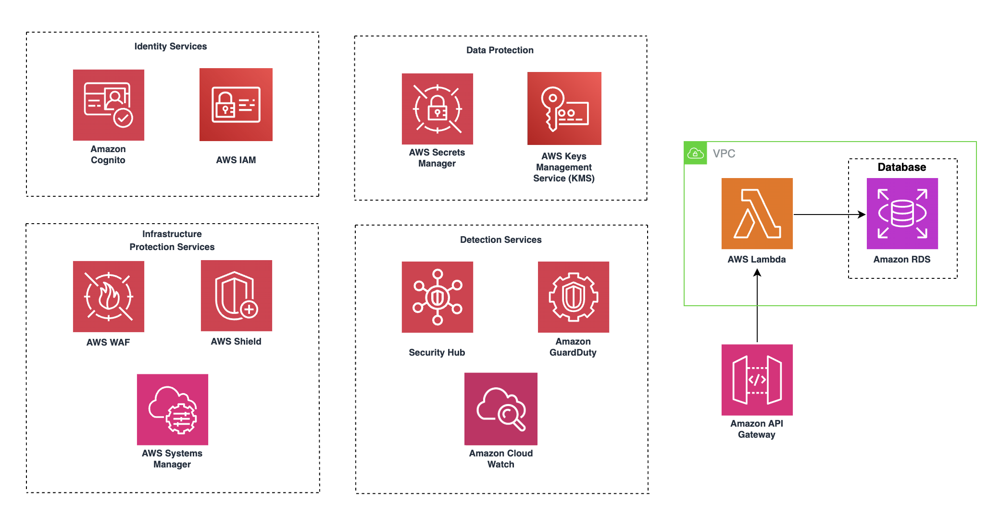

# Security Documentation & Network Architecture  

## Shared Responsibility Model 


### Customer Responsibilities (Security in the Cloud):
- Data Protection
- Identity & Access Management
- Application Security
- Network Security Configuration:

[Learn more](https://aws.amazon.com/compliance/shared-responsibility-model/)


This document outlines the existing network and security configurations implemented for this project. Additionally, it provides recommendations and guidance on leveraging AWS services and features to enhance security, monitor application performance, and maintain compliance 


## 1. Network Architecture


### 1.1 VPC & Subnets  
VPC Configuration:  
- Leveraged existing VPC in AWS Account since organizational policies prevent new VPC creation
- CIDR Range is inherited from existing VPC configuration

#### Subnet Configuration:  

| Subnet Type | AZ             | Key Services                       |
|-------------|----------------|------------------------------------|
| Private     | ca-central-1a  | Lambda                             |
| Private     | ca-central-1b  | RDS Proxy, Amazon RDS              |
| Private     | ca-central-1c  | Backup RDS                         |
| Public      | ca-central-1   | NAT Gateway, Internet Gateway      |


#### Services Deployment:  

#### Private Subnets:  
- **AWS Lambda:**   
  - Runtime environment for application logic  
  - No public IP addresses  
  - Outbound internet via NAT Gateway  

- **Amazon RDS (PostgreSQL):**  
  - Accessed exclusively via RDS Proxy  
  - No direct public access  
  - Encrypted connections via SSL/TLS  

  Since VPC Endpoints are not used, Lambda accesses S3, ECR, and other AWS services over the public internet through the NAT Gateway.


#### Public Subnets:  
- **NAT Gateway:** [Learn more](https://docs.aws.amazon.com/vpc/latest/userguide/vpc-nat-gateway.html)

  - Required for private subnet services to fetch external packages/updates  
  - Egress-only internet access for Lambda  
  - Cost-optimized single AZ deployment  

- **Internet Gateway:** [Learn more](https://docs.aws.amazon.com/vpc/latest/userguide/VPC_Internet_Gateway.html)
  - Enables public access to API Gateway 

#### Services outside of VPC:  
- **S3 Buckets:** [Learn more](https://aws.amazon.com/pm/serv-s3/?gclid=CjwKCAiAlPu9BhAjEiwA5NDSA1VjMbPPYbzEKHPHFwna4OblKvQe5sm9sigb9iHW69Zc_pxuRifGzxoCUiEQAvD_BwE&trk=936e5692-d2c9-4e52-a837-088366a7ac3f&sc_channel=ps&ef_id=CjwKCAiAlPu9BhAjEiwA5NDSA1VjMbPPYbzEKHPHFwna4OblKvQe5sm9sigb9iHW69Zc_pxuRifGzxoCUiEQAvD_BwE:G:s&s_kwcid=AL!4422!3!536324434071!e!!g!!s3!11346198420!112250793838)
  - Accessed via NAT Gateway through Lambda functions  
  - No internet routing through NAT Gateway  

  #### How objects in S3 are accessed:

  

  The above diagram illustrates the use of S3 pre-signed URLs in our architecture. The process works as follows:

  1. Client Request: The client first requests a pre-signed URL by making an API call to the Amazon API Gateway

  2. Pre-Signed URL Generation: The API Gateway invokes an AWS Lambda function, which is responsible for generating the pre-signed URL. The Lambda function checks for the appropriate permissions (PutObject action) for the requested S3 bucket

  3. Permission Validation: If permissions are validated, the Lambda function returns the generated pre-signed URL to the client

  4. File Upload: The client uses this pre-signed URL to upload files directly to S3, bypassing the need for the server to handle large file uploads. This approach ensures:

      - Secure, time-limited access to the S3 bucket without exposing long-term credentials

      - Offloading file transfer workload from backend servers, reducing latency and cost


  Learn More:
  - [Sharing objects with presigned URLs](https://docs.aws.amazon.com/AmazonS3/latest/userguide/ShareObjectPreSignedURL.html)

  - [Download and upload objects with presigned URLs](https://docs.aws.amazon.com/AmazonS3/latest/userguide/using-presigned-url.html)
  
  
  Additional security measures:
  - All data is encrypted at rest using SSE-S3 (AES-256)
  - Public access is blocked for all S3 buckets
  - SSL connections are enforced for secure data transfer

- **Amazon API Gateway:**
  - Deployed in AWS public cloud space  
  - Protected by regional security controls  
  - Custom Lambda Authorizers validate user permissions before accessing endpoints
  - Uses Cognito User Pools for authentication and role-based access control
  - IAM policies restrict API Gateway access based on user roles

- **Amazon Bedrock:**
  - Requires explicit model access requests for utilization
  - API interactions secured using IAM roles and encrypted connections

- **AWS AppSync:** 
  - Provides real-time data queries and synchronizes data between clients and backend 
  - Integrated with IAM for authentication and runs in the public cloud space
  - SQS queues with server-side encryption (SSE) enabled using AWS-managed keys
  - Only specific Lambda functions are granted permissions to send or receive messages

- **Amazon Cognito:** 
  - Provides authentication and authorization for Lambda access
  - Role-based access control via IAM roles and policies
  - Triggers (Pre-Sign-Up, Post-Confirmation, Post-Authentication) manage user provisioning.
  - Secures real-time data sync via AppSync with Lambda authorizers

- **Amazon SQS:**
  - Facilitates real-time data synchronization and GraphQL APIs
  - Integrated with Cognito for secure, authenticated access
  - Employs server-side encryption using AWS-managed keys
  - Connects to Lambda functions for data processing and custom business logic
  - Configured with IAM roles to enforce least-privilege access control
  - Supports secure WebSocket connections for live data updates

- **Amazon ECR:**
  - Lambda functions utilize Docker images stored in Amazon ECR 
  - Images are securely pulled over the internet via the NAT Gateway


## 1.2 Security Configuration




This diagram illustrates how our architecture handles key security aspects by leveraging AWS services tailored for each security domain. Identity Services, including AWS IAM and Amazon Cognito, ensure secure authentication and access control. Data Protection is enforced through AWS Secrets Manager and AWS KMS for secure storage and encryption. Infrastructure Protection relies on AWS WAF, AWS Shield, and AWS Systems Manager to safeguard against threats. Detection Services such as Security Hub, Amazon GuardDuty, and Amazon CloudWatch provide continuous monitoring and threat detection


## 2. Security Controls

### 2.1 Network Security

**Security Groups:**

| Name          | Rules                                           |
|---------------|-------------------------------------------------|
| Lambda-SG     | Allow outbound: 5432 (RDS Proxy)                 |
| RDS-Proxy-SG  | Allow inbound: 5432 from Lambda-SG               |
| Default-SG    | Block all inbound, allow outbound                |

**NACLs:**
- Default NACLs in use 
- No custom rules - inherits Control Tower baseline:  
  - Inbound: ALLOW ALL  
  - Outbound: ALLOW ALL  


## 3. Data Store Security

### 3.1 Encryption

**Purpose:** Ensure all stored data is encrypted at rest to meet compliance and security standards


### 3.2 Access Controls

#### RDS Proxy:
- IAM authentication required  
- Connection pooling limits credential exposure  
- Audit logs enabled via CloudWatch  


## 4. Secrets & Parameters

### 4.1 Credential Management

**Purpose:** Securely manage sensitive credentials such as RDS passwords

#### AWS Secrets Manager:
- Creates a new secret named DBSecret for RDS credentials
- Enhances security by regularly updating credentials without manual intervention


## 5. Security Services

### 5.1 AWS WAF & Shield

**WAF Rules Applied:** [Learn more](https://docs.aws.amazon.com/AmazonCloudFront/latest/DeveloperGuide/distribution-web-awswaf.html)
- SQLi Protection (AWSManagedRulesSQLiRuleSet)  
- XSS Protection (AWSManagedRulesXSSRuleSet)  
- Request Threshold: 100 requests/min per IP  

**Shield Standard:** [Learn more](https://docs.aws.amazon.com/waf/latest/developerguide/ddos-overview.html)
- Enabled on API Gateway  
- CloudWatch alarms for DDoS detection  


### 5.2 Security Hub 

**Purpose:** Enable continuous security monitoring and automate compliance checks [Learn more](https://docs.aws.amazon.com/securityhub/latest/userguide/what-is-securityhub.html)

#### Account-level monitoring recommendations:

- Enable Security Hub in the AWS Management Console for the target region (e.g., ca-central-1)
- Integrate Security Hub with AWS services (e.g., GuardDuty) for comprehensive security analysis
- Use Security Hub Insights to identify and prioritize security issues across AWS accounts

#### How to Use:

- Navigate to Security Hub in the AWS console
- Review findings generated from AWS best practices and integrated security services
- Apply security standards like AWS Foundational Security Best Practices
- Use custom insights and filters (e.g., resources.tags.Project = "AILA") to focus on relevant resources
- Remediate issues based on the severity and compliance requirements


## 6. RDS Security

### 6.1 RDS Encryption

**Purpose:** Secure RDS data at rest using AWS KMS encryption and prevent accidental deletion

- Enabled storage encryption for storageEncrypted is set to true
- Referenced an existing KMS key using kms.Key.fromKeyArn() for encryption
- deletionProtection is set to true to prevent unintended RDS deletions.

### 6.2 RDS Security Groups 

**Purpose:** Control database access by allowing PostgreSQL traffic (5432) only from trusted CIDRs

CDK Implementation: 
```typescript
vpcStack.privateSubnetsCidrStrings.forEach((cidr) => {
    dbSecurityGroup.addIngressRule(
        ec2.Peer.ipv4(cidr),
        ec2.Port.tcp(5432),
        `Allow PostgreSQL traffic from ${cidr}`
    );
});

```

### 6.3 RDS Proxy

**Purpose:** Purpose: Enhance RDS access performance, security, and scalability by utilizing Amazon RDS Proxy

  - IAM Authentication: RDS Proxy requires IAM authentication for secure access
  - Connection Pooling: Efficiently manages and reuses database connections, reducing the load on RDS
  - TLS Enforcement: Secure connections with optional TLS enforcement for data-in-transit encryption
  - Role Management: IAM roles grant rds-db:connect permissions to trusted Lambda functions
  - Fault Tolerance: Proxies automatically handle database failovers, improving application availability
  - Security Groups: Configured to allow only trusted Lambda functions and services within private subnets to connect


## 7. S3 Security

### Bucket Security Configurations

**Purpose:** Ensure data confidentiality by encrypting S3 objects and blocking public access [Learn more](https://aws.amazon.com/s3/security/)

- Enabled S3-managed encryption (S3_MANAGED) for data at rest
- Blocked all public access with blockPublicAccess: s3.BlockPublicAccess.BLOCK_ALL
- Enforced SSL connections for secure data transfer by setting enforceSSL: true

CDK Implementation:
```typescript
blockPublicAccess: s3.BlockPublicAccess.BLOCK_ALL,
enforceSSL: true, // Enforce secure data transfer
encryption: s3.BucketEncryption.S3_MANAGED,
```

## 8. Security Group Configurations

**Purpose:** Secure network access between AWS components, ensuring least-privilege access

### 8.1 Key Security Group Controls in CDK:

| **Component**  | **CDK Location**       | **Key Security Control**                                      | **Purpose**                                      |
|----------------|------------------------|---------------------------------------------------------------|--------------------------------------------------|
| **RDS**        | `DatabaseStack`         | PostgreSQL (5432) only from private/VPC CIDRs                  | Restricts DB access to internal networks          |
| **Lambda**     | `ApiGatewayStack`       | IAM policies for Secrets, ENI management, and SQS access       | Limits Lambda access to necessary resources       |
| **SQS**        | `ApiGatewayStack`       | Lambda-only `SendMessage` access via `addToResourcePolicy`     | Secures SQS queue from unauthorized access        |
| **AppSync**    | `ApiGatewayStack`       | Lambda authorizer & `appsync:GraphQL` permissions              | Ensures secure, authenticated access to GraphQL APIs |
| **RDS Proxy**  | `DatabaseStack`         | IAM-based `rds-db:connect` permissions                         | Adds an extra layer of security between Lambda and RDS |


### 8.2 Examples from CDK infrastructure where these security measures are implemented:

#### Lambda Access to Secrets Manager:
```javascript
lambdaRole.addToPolicy(
  new iam.PolicyStatement({
    actions: ["secretsmanager:GetSecretValue"],
    resources: [`arn:aws:secretsmanager:${this.region}:${this.account}:secret:*`],
  })
);
```

#### SQS Queue Security (Lambda-Only Access):
```
messagesQueue.addToResourcePolicy(
  new iam.PolicyStatement({
    actions: ["sqs:SendMessage"],
    principals: [new iam.ServicePrincipal("lambda.amazonaws.com")],
    resources: [messagesQueue.queueArn],
  })
);
```

#### Private Subnet Access: Allows PostgreSQL traffic (port 5432) only from private subnet CIDRs:
```typescript
vpcStack.privateSubnetsCidrStrings.forEach((cidr) => {
    dbSecurityGroup.addIngressRule(
        ec2.Peer.ipv4(cidr),
        ec2.Port.tcp(5432),
        `Allow PostgreSQL traffic from private subnet CIDR range ${cidr}`
    );
});
```


#### Lambda Network Access: Enables Lambda to create network interfaces (ENIs) for VPC access
```typescript 
this.dbInstance.connections.securityGroups.forEach((securityGroup) => {
    securityGroup.addIngressRule(
        ec2.Peer.ipv4(vpcStack.vpcCidrString),
        ec2.Port.tcp(5432),
        "Allow PostgreSQL traffic from public subnets"
    );
});
```

#### Lambda Access to Secrets Manager:
```typescript 
lambdaRole.addToPolicy(
  new iam.PolicyStatement({
    effect: iam.Effect.ALLOW,
    actions: ["secretsmanager:GetSecretValue"],
    resources: [`arn:aws:secretsmanager:${this.region}:${this.account}:secret:*`],
  })
);
```


#### SQS Queue Security (Lambda-Only Access):
```typescript 
messagesQueue.addToResourcePolicy(
  new iam.PolicyStatement({
    actions: ["sqs:SendMessage"],
    principals: [new iam.ServicePrincipal("lambda.amazonaws.com")],
    resources: [messagesQueue.queueArn],
  })
);
```

### 8.3 Lambda Function Access & Invocation


#### **Summary of Lambda Function Access** [Learn more](https://docs.aws.amazon.com/cognito/latest/developerguide/cognito-user-pools-working-with-lambda-triggers.html#:~:text=Except%20for%20Custom%20sender%20Lambda,attempts%2C%20the%20function%20times%20out.): 

| **Lambda Function**                | **Access Level** | **Trigger/Invocation**                   | **Who Can Access?**                       |
|-------------------------------------|-------------------|-------------------------------------------|--------------------------------------------|
| `studentFunction`                   |  Private        | student   | Authenticated users in **student** group   |
| `instructorFunction`                |  Private        | instructor | Authenticated users in **instructor** group|
| `adminFunction`                     |  Private        | admin  | Authenticated users in **admin** group     |
| `preSignupLambda`                   |  Private        | Cognito **Pre-Sign-Up** trigger           | **Cognito internal trigger** only          |
| `addStudentOnSignUp`                |  Private        | Cognito **Post-Confirmation** trigger     | **Cognito internal trigger** only          |
| `adjustUserRoles`                   |  Private        | Cognito **Post-Authentication** trigger   | **Cognito internal trigger** only          |
| `TextGenLambdaDockerFunc`           |  Private        | student | **student** group users                    |
| `GeneratePreSignedURLFunc`          |  Private        | instructor | **instructor** group users                 |
| `DataIngestLambdaDockerFunc`        |  Private        | S3 Event (S3 PUT/DELETE)                  | Triggered by **S3 events** only            |
| `GetFilesFunction`                  |  Private        | instructor | **instructor** group users                 |
| `DeleteFileFunc`                    |  Private        | instructor | **instructor** group users                 |
| `DeleteModuleFunc`                  |  Private        | instructor | **instructor** group users                 |
| `DeleteLastMessage`                 |  Private        | student | **student** group users                    |
| `adminLambdaAuthorizer`             |  Private        | API Gateway Lambda Authorizer (admin)     | Internal to **API Gateway** for auth checks|
| `studentLambdaAuthorizer`           |  Private        | API Gateway Lambda Authorizer (student)   | Internal to **API Gateway** for auth checks|
| `instructorLambdaAuthorizer`        |  Private        | API Gateway Lambda Authorizer (instructor)| Internal to **API Gateway** for auth checks|


## 9. Cognito User Authentication

### 9.1 Purpose 

AWS Cognito provides user authentication and authorization, enabling **secure access** to Lambda functions based on user roles. By integrating Cognito with Lambda, we ensure that **only authenticated users** with the **appropriate permissions** can invoke Lambda functions, maintaining the **principle of least privilege**

[Learn more](https://docs.aws.amazon.com/cognito/latest/developerguide/authentication.html)

---

### 9.2 How Cognito Secures Lambda Invocations

- **User Pool Creation:**  
  Cognito **User Pools** manage user registration and sign-in
  - Supports multi-role user groups (e.g., student, instructor, admin)
  - Automatic verification of user credentials

- **Role-Based Access Control (RBAC):**  
  Cognito assigns **IAM roles** based on user groups, allowing **fine-grained access control** to specific Lambda functions.
  - Example roles: `StudentRole`, `InstructorRole`, `AdminRole`
  - IAM policies attached to each role define permitted Lambda invocations

- **Lambda Integration:**  
  Cognito-generated **JWT tokens** are validated by Lambda **authorizer functions** to ensure:
  - Only **authorized users** can invoke specific Lambda endpoints
  - **JWT tokens** expire 30 days after a user signs in [Learn more](https://docs.aws.amazon.com/cognito/latest/developerguide/amazon-cognito-user-pools-using-tokens-with-identity-providers.html)
  - Access is logged and monitored via **CloudWatch**

---


### 9.3 Cognito Integration in CDK (ApiGatewayStack)

#### **User Pool & App Client Configuration:**
```typescript
const userPool = new cognito.UserPool(this, 'UserPool', {
  signInAliases: { email: true },
  selfSignUpEnabled: true,
  userVerification: { emailStyle: cognito.VerificationEmailStyle.CODE },
  passwordPolicy: { minLength: 10, requireLowercase: true, requireUppercase: true, requireDigits: true, requireSymbols: true},
});

const appClient = userPool.addClient('AppClient', {
  authFlows: { userPassword: true, userSrp: true },
});

```

## 10 API Gateway Security

### 10.1 Purpose

AWS API Gateway acts as the entry point for clients, enabling secure, scalable, and managed API interactions. It integrates with AWS IAM, Cognito, and Lambda Authorizers to enforce authentication and authorization.

### 10.2 Security Measures Applied:
- Cognito User Pools for authentication
- IAM Policies to enforce least-privilege access
- Lambda Authorizers for custom permission validation
- AWS WAF to mitigate DDoS attacks and malicious traffic


[Learn more](https://docs.aws.amazon.com/apigateway/latest/developerguide/security.html)

### 10.3 Custom Lambda Authorizer for API Gateway

Lambda Authorizers provide fine-grained access control by validating requests before they reach the API Gateway methods. This allows us to enforce custom authentication and authorization logic, such as role-based access control (RBAC) or JSON Web Token (JWT) validation

```typescript
const lambdaAuthorizer = new apigateway.TokenAuthorizer(this, 'LambdaAuth', {
  handler: myLambdaAuthorizer,
  identitySource: 'method.request.header.Authorization',
});

const restrictedResource = api.root.addResource('restricted');
restrictedResource.addMethod('POST', new apigateway.LambdaIntegration(myLambda), {
  authorizationType: apigateway.AuthorizationType.CUSTOM,
  authorizer: lambdaAuthorizer,
});
```

**Key Features of Lambda Authorizer**:
- Custom Authentication: Uses a Lambda function to validate JWT tokens or other credentials before granting access
- Identity Source: Extracts authentication data from the Authorization header in HTTP requests
- Granular Access Control: Ensures that only authorized users can access specific API methods


## 12 AWS Systems Manager Security


### 12.1 Purpose

AWS Systems Manager (SSM) provides centralized management, automation, and security enforcement for AWS resources, helping secure access to infrastructure and maintain compliance through patching, logging, and configuration management

Amazon CloudWatch is used to monitor AWS resources, applications, and security logs. It plays a crucial role in performance monitoring [Learn more](https://aws.amazon.com/systems-manager/)


### 12.2 Security Measures:
- Parameter Store Access Logs: Monitors access to sensitive configuration data, including secrets and API keys
- Anomalous Parameter Store Access: Triggers alarms when unauthorized services or users attempt to retrieve sensitive parameters

 

 ## 13 AWS Key Management Service (KMS)


 ### 13.1 Purpose

AWS KMS (Key Management Service) provides centralized encryption key management, helping to keep sensitive data encrypted both at rest and in transit. It integrates with multiple AWS services to offer scalable and automated encryption security [Learn more](https://aws.amazon.com/kms/)  

### 13.2 Security Measures:
- KMS Key Access Logs: Records every use of an encryption key to help detect unauthorized decryption attempts
- Excessive Key Usage: Triggers alerts if a specific key is accessed more than usual, potentially indicating a compromise


## 14. Amazon ECR

**Purpose:**  
Amazon Elastic Container Registry (ECR) provides a secure, scalable private container registry. It integrates with AWS Identity and Access Management (IAM) and other AWS security services to protect container images

[Learn more](https://docs.aws.amazon.com/AmazonECR/latest/userguide/infrastructure-security.html)

---

**Key Security Measures:**
1. **Private Repositories**  
   - Images are stored privately; access is controlled by IAM and resource-based policies.  
   - [Learn more](https://docs.aws.amazon.com/AmazonECR/latest/userguide/repository-policies.html)

2. **TLS Enforcement**  
   - All ECR API calls must use TLS 1.2 or higher, ensuring data in transit is secure

3. **IAM Roles & Policies**  
   - There are permissions (e.g., `ecr:GetAuthorizationToken`, `ecr:BatchGetImage`) that control who can push/pull images

5. **Lifecycle Policies**  
   - Automatically remove outdated images to minimize storage costs and reduce the attack surface

---


**Recommendation:**  
- Enable image scanning on push to detect vulnerabilities and remediate issues 
- Regularly review ECR logs in **AWS CloudTrail** to identify suspicious or unauthorized access attempts
- Implement **lifecycle policies** to retain only the most recent, patched images for better security and cost efficiency
